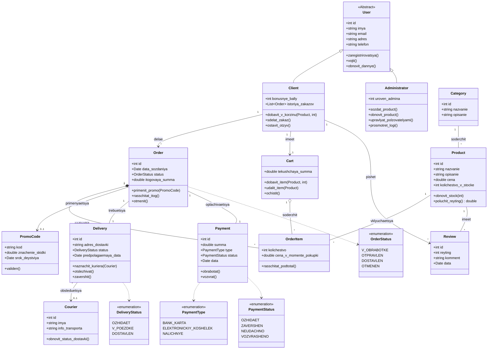

```mermaid 
classDiagram

    %% 1. User (Абстрактный)
    class User {
        <<Abstract>>
        +int id
        +string imya
        +string email
        +string adres
        +string telefon
        +zaregistrirovatsya()
        +vojti()
        +obnovit_dannye()
    }

    class Client {
        +int bonusnye_bally
        +List~Order~ istoriya_zakazov
        +dobavit_v_korzinu(Product, int)
        +sdelat_zakaz()
        +ostavit_otzyv()
    }

    class Administrator {
        +int uroven_admina
        +sozdat_product()
        +obnovit_product()
        +upravlyat_polzovatelyami()
        +prosmotret_logi()
    }

    %% 2. Product
    class Product {
        +int id
        +string nazvanie
        +string opisanie
        +double cena
        +int kolichestvo_v_stocke
        +obnovit_stock(int)
        +poluchit_reyting() double
    }

    class Category {
        +int id
        +string nazvanie
        +string opisanie
    }

    %% 3. Order
    class Order {
        +int id
        +Date data_sozdaniya
        +OrderStatus status
        +double itogovaya_summa
        +primenit_promo(PromoCode)
        +rasschitat_itog()
        +otmenit()
    }

    class OrderItem {
        +int kolichestvo
        +double cena_v_momente_pokupki
        +rasschitat_podtotal()
    }

    class Cart {
        +double tekushchaya_summa
        +dobavit_item(Product, int)
        +udalit_item(Product)
        +ochistit()
    }

    class PromoCode {
        +string kod
        +double znachenie_skidki
        +Date srok_deystviya
        +validen()
    }

    %% 4. Logistika
    class Delivery {
        +int id
        +string adres_dostavki
        +DeliveryStatus status
        +Date predpolagaemaya_data
        +naznachit_kuriera(Courier)
        +otslezhivat()
        +zavershit()
    }

    class Courier {
        +int id
        +string imya
        +string info_transporta
        +obnovit_status_dostavki()
    }

    %% 5. Payment
    class Payment {
        +int id
        +double summa
        +PaymentType type
        +PaymentStatus status
        +Date data
        +obrabotat()
        +vozvrat()
    }

    %% 6. Review
    class Review {
        +int id
        +int reyting
        +string komment
        +Date data
    }

    %% ENUMS
    class OrderStatus {
        <<enumeration>>
        V_OBRABOTKE
        OTPRAVLEN
        DOSTAVLEN
        OTMENEN
    }

    class DeliveryStatus {
        <<enumeration>>
        OZHIDAET
        V_POEZDKE
        DOSTAVLEN
    }

    class PaymentType {
        <<enumeration>>
        BANK_KARTA
        ELEKTRONICKIY_KOSHELEK
        NALICHNYE
    }

    class PaymentStatus {
        <<enumeration>>
        OZHIDAET
        ZAVERSHEN
        NEUDACHNO
        VOZVRASHENO
    }

    %% Nasledovanie
    User <|-- Client
    User <|-- Administrator

    %% Client i Order
    Client "1" --> "*" Order : delae
    Client "1" --> "1" Cart : imeet
    Cart "1" o-- "*" OrderItem : soderzhit

    %% Order i Product
    Order "1" *-- "*" OrderItem : soderzhit
    Product "1" -- "*" OrderItem : vklyuchaetsya

    %% Product i Category
    Category "1" -- "*" Product : soderzhit

    %% Order i PromoCode
    Order "*" --> "0..1" PromoCode : primenyaetsya

    %% Logistika
    Order "1" -- "1" Delivery : trebuetsya
    Delivery "*" --> "0..1" Courier : obsleduetsya

    %% Payment
    Order "1" -- "1" Payment : oplachivaetsya

    %% Review
    Client "1" --> "*" Review : pishet
    Product "1" -- "*" Review : imeet

    %% Enum zavisimosti
    Order ..> OrderStatus
    Delivery ..> DeliveryStatus
    Payment ..> PaymentType
    Payment ..> PaymentStatus
```
